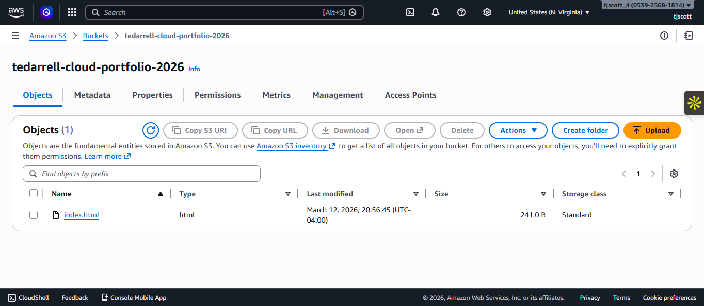
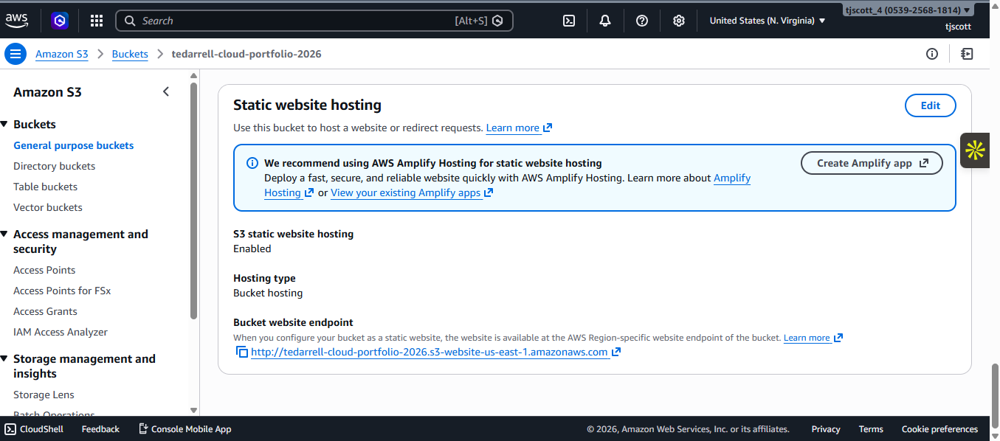
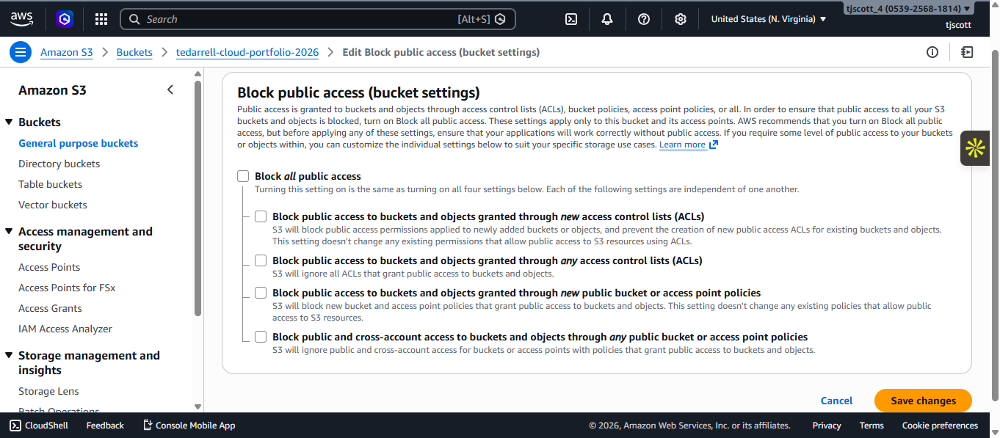
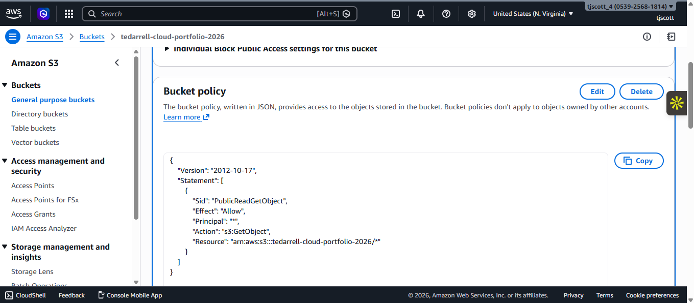
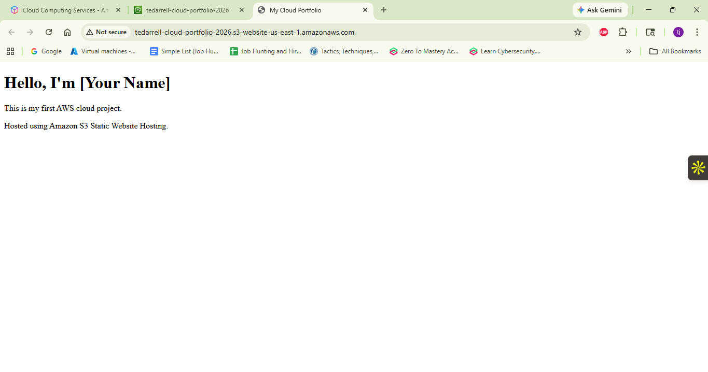
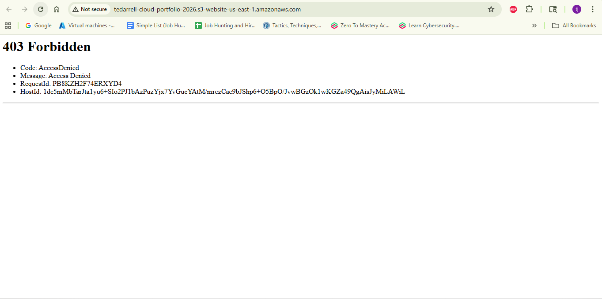
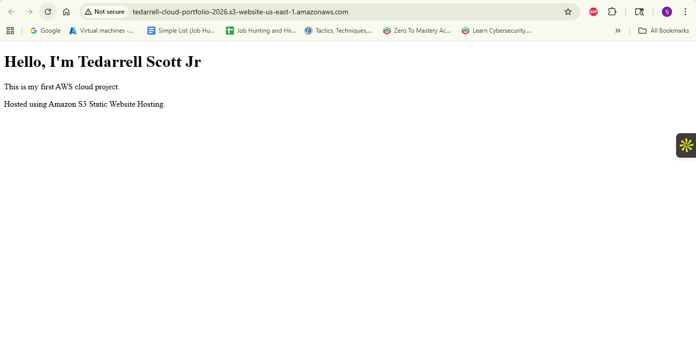

# AWS S3 Static Website Hosting Project

## Overview
This project demonstrates how to host a static website using Amazon S3 and configure bucket permissions for public access. It also includes troubleshooting a common **403 Access Denied** error caused by misconfigured bucket policies.

## AWS Services Used
- Amazon S3
- S3 Static Website Hosting
- S3 Bucket Policies

## Project Architecture
User Browser → S3 Website Endpoint → S3 Bucket → index.html

## Deployment Steps

### 1. Create S3 Bucket
A globally unique S3 bucket was created to store website files.



---

### 2. Upload Website Files
The `index.html` file was uploaded to the bucket.


---

### 3. Enable Static Website Hosting
Static website hosting was enabled and `index.html` set as the index document.



---

### 4. Configure Public Access
Block Public Access settings were modified to allow public website hosting.



---

### 5. Configure Bucket Policy
A bucket policy was applied to allow public read access to objects.



---

### 6. Verify Website Deployment
The website was successfully accessed via the S3 website endpoint.



---

## Troubleshooting: 403 Access Denied

To simulate a real-world troubleshooting scenario, the bucket policy was removed. This caused the website to return a **403 Access Denied** error.



The issue was resolved by restoring the correct bucket policy allowing `s3:GetObject`.



---

## Key Skills Demonstrated

- AWS S3 configuration
- Static website hosting
- Bucket policy management
- AWS permission troubleshooting
- Diagnosing and resolving access errors

---

## Website Endpoint

```
http://tedarrell-cloud-portfolio-2026.s3-website-us-east-1.amazonaws.com
```

---

## Author

Tedarrell Scott Jr  
Aspiring Cloud Support Engineer
